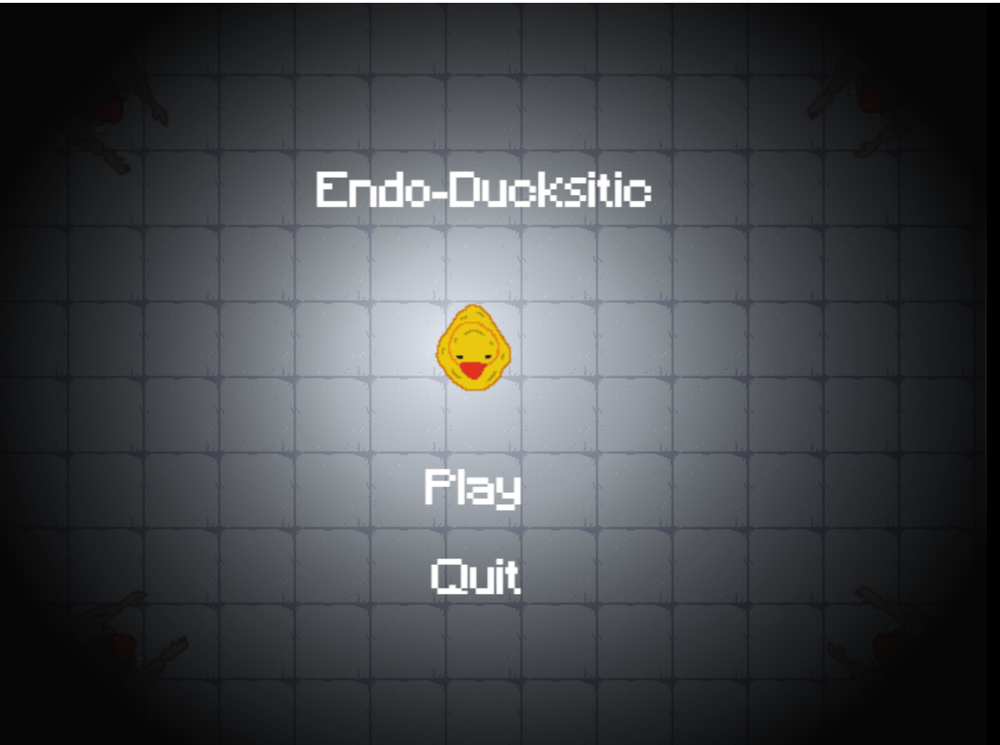

# Endo-Ducksitic
In a world filled with Parasites that infected the whole Duck population in Ducklus, you, as a young duck soldier named Marcus, has to traverse through the darkness of
the facility of where the Parasite spread. All your teamates have been abducted or killed, and you are the last person to Explore and kill any Parasites that lurk within the facility.

## Objective
The objective in the game is to kill every Parasite in each level using the movement control given.

## User Manual
- ### Installation:
  Clone the repository and install Gdevelop. The version of Gdevelop used is This version of GDevelop is: 5.3.187. Then, open the file by selecting the game.json file.
  Or you can play the game from this link : [https://gd.games/lutfiizzat/neo-ducksitic](https://gd.games/lutfiizzat/neo-ducksitic) (not recommended, the game stutters and
  the controls are a tad janky from here.

## Acknowledgement
The idea is inspired upon a game called Endoparasitic. A lot of thanks to William for the guidance given.

        
## Video Demo and Screenshots
Watch Video Demo on YouTube: [https://youtu.be/qa82ZTrfXAk](https://youtu.be/qa82ZTrfXAk)
<table>
  <tr>
    <td></td>
    <td></td>
  </tr>
  <tr>
    <td></td>
    <td></td>
  </tr>
  <tr>
    <td></td>
    <td></td>
  </tr>
  <tr>
